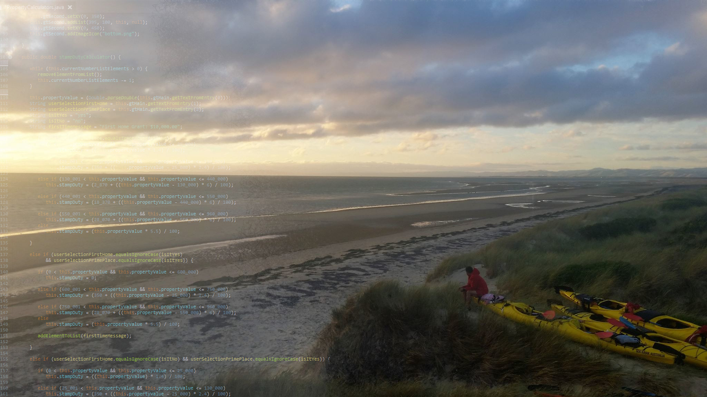

#MyProfile
  <article>
  
    <h3>Personal Information</h3>
    

      I am a 40 years old aspiring Information Technology student who is interested in Data Science, Artificial Intelligence, and Machine Learning.     
      I was born in Turkey in 1980. After 30 years, I moved to Australia in 2010 and became an Australian citizen in 2014. I am married and we are currently expecting our first baby.    
      I currently hold a Bachelor's Degree in Urban Planning, which I obtained in 2006, in Turkey. I also started my master’s degree in Urban Design in 2008.
      However, I did not finish the degree as I decided to move to Australia in 2010. I have more than 14 years of experience in urban planning, urban design, town planning, and architectural fields.  
      I was always good with languages, I can speak, Turkish (native), English (fluent), French(basic), and Portuguese(beginner).   
      I feel happy while doing outdoor activities with my friends and family. I love camping, fishing, hiking, kayaking, and walking in nature.
      I was even part of a dragon boat racing team where we competed in the 2016 Australian Championships a 2016 Club Crew World Championships.   
      I love quiet and relaxing weekends with my wife. I also love catching up with a small group of friends and family and having meaningful conversations.
      Solving puzzles, playing logic and strategic games make me happy.
    

  </article>
  <article>
    <h3>Interest in IT?</h3>
    
 I have always been interested in technology and technological improvements since my childhood.
      I believe everything started when I first saw Star Wars, Star Tek, and Battlestar Galactica and fell in love at the same moment in the 1990s.
      My dad got me my first computer in 2000 when I got into university. Since then, computers are a big part of my life at home and work.    
      Working with computers, understanding programming languages, and being able to produce something with them was always one of my dreams.
      Since my arrival in Australia, I was focusing on earning money to build a life and pay my bills to survive.
      However, I never lost my interest in IT and I kept telling people that one day I will be going out of my current industry and realize my dreams.      
      Even though I was never directly in the IT industry, I chose to implement technological improvement in my professional works at all times.
      I kept doing researches about, how to improve efficiency, how to present better, what are the newest software related to my fields, how to improve the quality of the products, etc.     
      I can currently create small applications in Java and Python.
      Also, I have an average understanding of how the database systems work and communicate with the program, which I learned during my previous courses.  
      COVID is one of the worst things that recently happened to the world. However, it also created an opportunity for me to spare much needed time to study and chase my dreams.
      Initially, I enrolled for 1 course to see if I still have the patience to study. After finishing that, I realized that even taking 1 course and achieving good results made me feel accomplished.
      Most importantly, I am now one step closer to my dream. Therefore, I enrolled in further courses to be able to obtain a Bachelor of Information Technology degree at RMIT in near future.
    

  </article>
  <article>
    <h3>Why did I choose RMIT?</h3>
    
 RMIT is one of the most reputable universities in the world in Computer Science and Information Systems. Besides, the university provides an online education option to the students which provide flexibility.
      Furthermore, the degree which I will be obtaining from RMIT will also be recognized in other countries if I choose to relocate to another country in the future.
    

  </article>

  <article>
    <h3>What is my expectation?</h3>
    
 The word is changing rapidly because of technological improvements. Therefore, I desire to have the expert knowledge to be recognized in the industry and to make a difference in a changing world. Following my graduation, I want to work in machine learning and artificial intelligence fields.
      Therefore, I am expecting to learn all up to date languages and knowledge to achieve this and fulfill my dream.
    

  </article>

</body>
</html>
